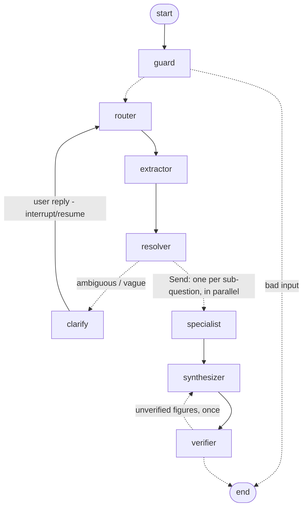

# Real-Estate Asset Manager Assistant (LangGraph multi-agent)

A prototype virtual asset-management assistant that answers natural-language questions about a
real-estate portfolio from its general ledger. A LangGraph workflow routes each request through
specialised agents (router, extractor, resolver, finance / portfolio / audit / knowledge
specialists, synthesizer, verifier), with deterministic tools doing every calculation and a
Streamlit chat UI on top.

- **Live demo:** https://rem-asset-manager-agent.streamlit.app (Streamlit Community Cloud; the first load after idle takes ~30 s)
- **Monitoring dashboard:** the *Monitoring* page of the app (latency, tokens, cost, verification, routing KPIs)
- **Evaluation run (27 questions, verbatim answers):** [`docs/EVAL_RESULTS.md`](docs/EVAL_RESULTS.md)

Example interactions (all real outputs, see the evaluation report):

| You ask | The assistant |
|---|---|
| *What is the total P&L for all my properties this year?* | Interprets "this year" as 2025 YTD because the data ends 2025-03, says so, and answers: revenue €592,124.15, expenses €230,313.83, net €361,810.32, with a caveat about duplicate rows. |
| *How does this quarter compare to the same period last year?* | 2025-Q1 vs 2024-Q1: revenue +€51,002.15 (+9.43%), expenses −€48,499.10, net +€99,501.25 (+37.93%). |
| *Who are my top tenants, and is anything unusual in the numbers?* | Runs two specialists in parallel: Tenant 7 (30% of revenue) leads; the audit finds 1,747 exact duplicate rows, a double-mapped ledger code, reversal pairs and sign anomalies. |
| *What is the price of my asset at 123 Main St compared to 456 Oak Ave?* | Explains that the ledger has no prices or valuations, that neither address exists, lists the five real properties and offers a revenue comparison instead. |
| *numbers please* | Pauses the graph and asks a clarification question; your reply resumes the same run. |

---

## 1. Setup

Requirements: Python 3.11+ (developed on 3.12), an OpenAI API key.

```bash
git clone https://github.com/ilyayaver95/real-estate-multiagent.git
cd real-estate-multiagent
python3.12 -m venv .venv && source .venv/bin/activate
pip install -r requirements.txt

cp .env.example .env          # then put your OPENAI_API_KEY in .env
streamlit run app/streamlit_app.py
```

Other entry points:

```bash
pytest                                   # 94 offline tests, no API key needed (~1s)
python scripts/smoke_live.py "Top 3 tenants in 2025"   # one question, with the agent trace
python scripts/run_eval.py               # 27-question evaluation -> docs/EVAL_RESULTS.md
```

Configuration (environment variables or `.env`): `OPENAI_API_KEY` (required), `REM_MODEL`
(default `gpt-4o-mini`), `REM_DATA_PATH` (default `data/ledger.parquet`), `REM_MAX_TOOL_ROUNDS`,
`REM_TEMPERATURE`, `REM_REQUEST_TIMEOUT`.

### Deploying to Streamlit Community Cloud

1. Push the repository to GitHub (public).
2. On share.streamlit.io choose *New app*, pick the repo, branch `main`, main file
   `app/streamlit_app.py`.
3. Under *Advanced settings → Secrets* add `OPENAI_API_KEY = "sk-..."`.
4. Deploy. `requirements.txt` is picked up automatically; the dataset ships in the repo.

---

## 2. The dataset (and what it means for the task)

`data/ledger.parquet` (CSV twin: `data/ledger.csv`) is the file provided with the assignment,
converted from parquet. It is **a general ledger**, not a property listing:

| | |
|---|---|
| Rows | 3,924 monthly ledger lines |
| Entity | PropCo |
| Properties | Building 17, 120, 140, 160, 180 |
| Tenants | Tenant 1 … Tenant 18 |
| Period | 2024-01 to 2025-03 (15 months; 2025 is a partial year) |
| Columns | ledger type / group / category / code / description, month, quarter, year, signed `profit` (EUR; revenue +, expenses −) |

Consequences that shaped the design:

- **There are no addresses, prices, valuations or appraisal dates.** The assignment's own
  example question ("price of 123 Main St") cannot be answered from this data. The system must
  recognise that and say so instead of inventing figures (intent `valuation_unsupported`,
  deterministic fallback answer).
- **Most expenses are booked at entity level** (mortgage interest, management and success fees,
  taxes, insurance: 96% of all expenses have no property). A per-property "P&L" is therefore
  revenue minus a small amount of direct costs; every property-level answer carries that caveat.
- **"This year" is ambiguous.** The data ends in March 2025. Relative phrases are anchored to
  the dataset's latest month ("as-of 2025-03") rather than the wall clock, and the answer states
  the interpretation.
- **Data-quality issues are real and detectable**: 1,747 exact duplicate rows, ledger code 4650
  mapped to two categories with identical rows (double counting), ±€154,415 booking/reversal
  pairs, 179 expense rows with a positive sign, 1,348 zero rows. The audit specialist reports
  them; the UI has a toggle to recompute with duplicates excluded (2024 revenue drops from
  €2,295,528.74 to €1,788,219.97). By default numbers are computed on the data as delivered,
  because that is what a reviewer will reproduce, and the duplicates are flagged in the answer.

---

## 3. Architecture

```
app/streamlit_app.py          Entry point: st.navigation over the two views
app/views/chat.py             Chat UI (examples, agent trace, dataset sidebar, dedupe toggle)
app/views/monitoring.py       Monitoring dashboard (KPIs from the telemetry store)
src/rem_agent/
  assistant.py                Facade: ask() / resume(); builds the graph once
  graph.py                    LangGraph StateGraph: nodes, Send fan-out, interrupt, verifier loop
  state.py                    Graph state (TypedDict + reducers) and per-task Send payload
  schemas.py                  Pydantic contracts: RouterOutput, ExtractionOutput, ResolvedTask, ...
  llm.py / config.py          Model factory (structured outputs) and settings
  telemetry.py                LLM usage callback, per-request metrics, JSONL store, KPI summary
  agents/
    guard.py                  Deterministic input checks (empty, blob, too long, no letters)
    router.py + prompts.py    Intent classification + decomposition (LLM, structured output)
    extractor.py              Slot extraction per sub-question (LLM, structured output)
    resolver.py               Deterministic grounding: fuzzy names, periods, defaults, merging
    toolkit.py                LangChain tools bound to the resolved task; records every call
    specialists.py            Finance / portfolio / audit tool loops, knowledge, fallbacks
    synthesizer.py            Final composition (pass-through for single tasks)
    verifier.py               Traces every figure in the answer back to tool outputs
  tools/
    periods.py                PeriodRange, natural-language period parsing (data-anchored)
    filters.py                LedgerFilter + apply_filter
    finance.py                pnl, compare_periods, trend, breakdown
    portfolio.py              property_details, portfolio_overview, top_tenants, tenant_details
    audit.py                  9 anomaly / data-quality checks
  data/loader.py, catalog.py  Dataset loading, normalisation, duplicate flagging, entity catalog
tests/                        94 offline tests (tools against hand-computed numbers, resolver,
                              guard, graph wiring with fake agents, regressions from live runs)
scripts/                      smoke_live.py, run_eval.py
```

### Design principles

1. **LLMs decide, tools compute.** Every number comes from a pandas function with unit tests;
   the model only chooses which tool to call and how to phrase the result. The verifier enforces
   this after the fact.
2. **Deterministic where determinism is possible.** Input validation, entity resolution, period
   parsing, default assumptions, "not found" and "no data" answers and anomaly detection are
   plain Python: faster, testable, and immune to hallucinated entity names.
3. **Act with stated assumptions rather than ask.** "This year" → 2025 YTD, "this quarter" vs
   "same period last year" → 2025-Q1 vs 2024-Q1, no period → all data. Each default becomes an
   explicit assumption that reaches the answer. Clarification is reserved for genuinely
   ambiguous names and messages with nothing concrete in them.
4. **Fail soft.** A specialist exception, an unknown tool or a tool error becomes a message in
   the answer, never a crash; the guard rejects garbage before any token is spent.

---

## 4. Multi-agent workflow with LangGraph



(`docs/graph.mmd` is the diagram generated from the compiled graph.)

| Node | Type | What it does |
|---|---|---|
| **guard** | deterministic | Rejects empty / non-text / JSON-CSV blobs / >2,000 chars with a helpful message. No LLM cost. |
| **router** | LLM, structured output (`RouterOutput`) | Classifies intent (12 intents: pnl, period_comparison, trend, property_details, portfolio_overview, tenant_analysis, anomaly_audit, data_scope, valuation_unsupported, general_knowledge, clarification, out_of_scope) and splits compound questions into sub-questions. Sees the last 6 conversation turns for follow-ups. |
| **extractor** | LLM, structured output (`ExtractionOutput`) | Pulls property / tenant mentions, timeframes (as `TimeSpec`), account terms, metric, top-N, breakdown dimension for every sub-question in one call. Skipped when no sub-question needs entities. |
| **resolver** | deterministic | Fuzzy-matches names onto the catalog ("bldg 17", "building seventeen" → Building 17; "123 Main St" → unknown with suggestions); parses periods anchored to the data's as-of month; applies and records defaults; maps account words ("parking", "mortgage interest") to ledger categories; merges sub-questions that resolve to the same tool call; applies safety nets around the LLM extraction (see Challenges). Produces `ResolvedTask`s. |
| **clarify** | `interrupt()` | Pauses the graph with a targeted question; the user's reply is merged into the question and routing restarts on the same thread (checkpointed with `InMemorySaver`). |
| **specialist** | fan-out via `Send` | One instance per task, run in parallel. `finance` (pnl, compare_periods, trend, breakdown), `portfolio` (property/tenant details, overview, top tenants, data dictionary), `audit` (anomaly checks) are tool-calling loops; `knowledge` is a single LLM call clearly labelled as general knowledge; `fallback` is deterministic (unsupported valuations, out-of-scope, data-scope, unknown entities, out-of-coverage periods). The obvious tool for each intent is pre-computed and handed to the specialist, which usually answers in one model call. |
| **synthesizer** | LLM or pass-through | Single-task answers are returned verbatim (no extra call). Multi-task answers, or revisions, go through one LLM call instructed to use only numbers present in the specialist answers. |
| **verifier** | deterministic | Extracts every money / percentage figure from the answer and matches it against the numbers the tools returned (tolerating rounding, k/M suffixes, percent-vs-ratio, and correct differences / ratios of two tool numbers). Unverified figures trigger one revision; the result is shown in the UI ("Figures verified 22/22"). |

State is a `TypedDict` with `operator.add` reducers for `results` and `trace`, so parallel
specialists append without clobbering each other. Every node appends a `TraceEvent` with a
summary, structured detail and duration, which the UI renders as the "Agent trace".

### Request lifecycle for a compound question

`Who are my top tenants, and is anything unusual in the numbers?`

1. guard: accepted.
2. router: `q1 tenant_analysis`, `q2 anomaly_audit`.
3. extractor: no entities, no period for either.
4. resolver: q1 → portfolio specialist, assumption "no timeframe given; using all data";
   q2 → audit specialist.
5. `Send` fans out: portfolio pre-computes `get_top_tenants(n=5)`, audit pre-computes
   `run_anomaly_audit()`; both LLM calls run concurrently.
6. synthesizer merges the two answers.
7. verifier: 22/22 figures traced to tool outputs. About 11 s end to end.

### Efficiency

- Typical single question: 3–7 s, 3 model calls (router, extractor, one specialist).
  Fallback / guard answers: 0–3 s and at most one model call.
- Pre-computing the obvious tool call removes a full model round-trip per specialist.
- Single-task answers skip the synthesizer call entirely.
- The extractor is skipped for intents that need no entities.
- Sub-questions resolving to identical parameters are merged before fan-out.
- Data is loaded once and cached; every tool runs in milliseconds; `gpt-4o-mini` keeps the cost
  per question well under a cent.

### Monitoring and LLM KPIs

Every request writes one telemetry record (`rem_agent/telemetry.py`): a LangChain callback
attached to the graph run counts model calls, input/output tokens and model time; the trace
supplies per-node latency, intents, specialists, tool calls, verification and revision flags.
Records go to `outputs/metrics.jsonl` (`REM_METRICS_PATH`; ephemeral on Streamlit Cloud,
persistent locally) and the chat shows the per-answer footprint ("6.2s · 3 LLM calls · 4,935
tokens · $0.0009").

The **Monitoring** page aggregates them:

| Group | KPIs |
|---|---|
| Latency | average, median, p95, max wall time; latency per request; average time per graph node |
| LLM usage & cost | LLM calls per request, input/output tokens per request, total tokens, estimated cost per request and cumulative (list prices per model, overridable via `REM_PRICE_INPUT/OUTPUT`) |
| Quality | figures verified / checked, verification pass rate, revision rate, clarification rate, guard rejections, error rate |
| Workload | intent mix, specialists used, tool calls per request, recent requests table, raw export |

Typical values with `gpt-4o-mini`: 2–3 model calls and roughly 3,000–5,000 tokens per simple
question (about $0.0005–0.001), 5 calls and 9,000 tokens for a compound question. A 47 s
outlier observed during testing (an API-side retry) is exactly what the p95 tile is for.

---

## 5. Error handling and robustness

| Situation | Behaviour |
|---|---|
| Property / tenant not in the dataset (`123 Main St`, `Tenant 99`) | Deterministic answer: not found, lists the real names and the closest matches, offers to compute for one of them. No calculation is run, so there is no risk of returning portfolio totals under a wrong label. |
| Mixed known + unknown (`Compare Building 17 with 456 Oak Ave`) | Computes the known one and states that the other does not exist. |
| Requested data not available (prices, valuations, appraisals, occupancy) | Explains what the ledger does and does not contain; offers the nearest supported analysis. |
| Period outside coverage (`2023`, `2026`) | No computation; states the covered range and the closest available period. Partially covered periods (`2025`) are computed with a "3 of 12 months" caveat. |
| Ambiguous name (`Building 1`, `Tenan`) | Clarification question listing the candidates; the reply resumes the same graph run. |
| Vague message (`numbers please`, `how are we doing?`) | Clarification with concrete examples. |
| Compound questions | Decomposed, run in parallel, merged, verified. |
| Follow-ups (`and for 2025?`) | Router sees recent turns and rewrites the sub-question to be self-contained. |
| Typos (`totl revnue for bilding 17`) | Handled by the LLM router plus fuzzy entity matching. |
| Wrong format (JSON, CSV, binary-ish, empty, 10 kB of text) | Rejected by the guard with guidance, before any LLM call. |
| Out of scope (jokes, weather) | Polite redirection listing what the assistant can do. |
| General knowledge (`What is NOI?`) | Answered from model knowledge, explicitly labelled as not computed from the ledger. |
| Specialist exception / tool error / model timeout | Caught per specialist; the answer says that part failed; other sub-questions still complete. |
| Hallucinated figures | Verifier flags numbers not traceable to tools and requests one revision; the UI shows the verification count. |

---

## 6. Implementation choices and reasoning

| Choice | Why |
|---|---|
| **LangGraph `StateGraph` with explicit nodes** rather than one ReAct agent | The task asks for a multi-agent workflow with detection, extraction, retrieval, calculation and response as distinct steps. Explicit nodes make each step testable and traceable, and let deterministic code sit between model calls. |
| **`Send` for compound questions** | Map-reduce over sub-questions is the idiomatic LangGraph way to parallelise; it also keeps each specialist's prompt small. |
| **`interrupt()` + `InMemorySaver` for clarification** | Human-in-the-loop is a first-class LangGraph feature; using it (rather than a chat-level hack) means the paused run resumes with its full state. A new thread id per turn keeps turns independent; conversation memory is passed explicitly as history. |
| **Structured outputs (Pydantic) for router and extractor** | Validated objects instead of parsed prose. Enums for intents and relative-period kinds constrain the model to the vocabulary the resolver understands. |
| **A deterministic resolver between extractor and specialists** | Entity names, periods and defaults are exactly the things LLMs get subtly wrong; doing them in code gave the biggest robustness gain in testing (see Challenges). |
| **Tools return caveats alongside numbers** | Partial coverage, unallocated expenses and duplicates travel with the data to the model, so answers stay honest without relying on the prompt to remember. |
| **Verifier with one revision loop** | Cheap insurance against invented figures; also produces a visible trust signal in the UI. Differences and ratios of tool numbers are accepted so correct LLM arithmetic is not penalised, while wrong arithmetic is still caught. |
| **Pre-computed tool call per intent** | Guarantees the right tool is used (deltas from `compare_periods`, not from the model) and cuts latency by about one model call. The specialist can still call more tools. |
| **Duplicates kept by default, flagged, with a toggle** | We cannot know from the file whether four identical bank charges are four accounts or a loading error; the default reproduces what a reviewer computes from the raw file, and the toggle shows the alternative. |
| **Relative dates anchored to the dataset** | "This year" literally (2026) has no data; anchoring to the latest month gives a useful answer and the assumption is stated. |
| **`gpt-4o-mini`, temperature 0** | Fast and cheap, good enough for structured classification/extraction when the heavy lifting is deterministic; the model is configurable via `REM_MODEL`. |
| **Streamlit** | Fastest route to a usable chat UI with an expandable trace; deploys for free from GitHub. |

---

## 7. Challenges and how they were solved

Everything below was found by running the system against real questions and reviewing the
traces (the regressions are now unit tests).

1. **The router rewrote "this year" as "in 2024".** It restates sub-questions to be
   self-contained and, having no clock, substituted a concrete year from its own sense of "now".
   The extractor then dutifully extracted 2024. *Fix:* the resolver parses relative phrases from
   the user's original wording first and only falls back to the model's structured fields; the
   prompt also forbids replacing time phrases.
2. **The extractor invented all five properties** for "How does this quarter compare…", because
   the catalog in its prompt listed them. That silently excluded entity-level expenses. *Fix:* a
   property is only kept if its number appears in the user's text; a full-catalog set collapses
   to "whole portfolio"; the prompt says to leave the list empty when none is named.
3. **The extractor dropped one of two named buildings** ("bldg 17 and Building 120"). *Fix:* a
   regex scan of the text adds missed `Building N` / `Tenant N` / street-address mentions.
4. **"P&L for 123 Main St" returned the portfolio total labelled as 123 Main St.** The
   address was never flagged, so the default filter (no property) applied. *Fix:* address
   patterns are detected deterministically and a task whose only named entities are unknown gets
   a deterministic "not found" answer instead of running any tool.
5. **An explicit second period was overridden by a relative flag.** For "Compare Q4 2024 with
   Q3 2024" the extractor tagged Q3 2024 as "same period last year". *Fix:* an explicit,
   parseable period always wins over the flag.
6. **"Revenue" became an account filter.** Fuzzy matching sent the generic word to the
   `revenue_rent_taxed` category, dropping parking and untaxed rent. *Fix:* a stop-list of
   generic finance words that never become filters; the metric drives `ledger_type` instead.
7. **The verifier produced false alarms**: numbers quoted inside caveat text, "Building 120"
   read as 120, "123 Main" read as 123 million, and correct LLM-computed deltas. *Fix:* harvest
   numbers from strings in tool output, strip entity names before scanning, require suffixes to
   be standalone, and accept correct differences / ratios of two tool numbers.
8. **Clarification was over-used.** The router flagged `needs_clarification` for the price
   question and the result varied between runs for the same input. *Fix:* clarification is now
   decided deterministically (ambiguous name, or nothing concrete in the user's words) and the
   router's flag only shapes the question text.
9. **Duplicate work on split questions.** "Trend … which month was worst?" became two
   sub-questions needing the same tool call. *Fix:* tasks that resolve to identical parameters are
   merged before fan-out.
10. **Latency.** Four sequential model calls made simple questions take 8–10 s. Pre-computed
    tool calls, a pass-through synthesizer for single tasks and skipping the extractor when it has
    nothing to extract brought typical questions to 3–7 s.
11. **Pandas 3 / LangGraph 1.x API changes** (`PeriodIndex` constructor, `InMemorySaver`,
    content blocks) were handled by pinning versions in `requirements.txt` and checking current
    docs rather than relying on memory.

---

## 8. Known limitations and next steps

- The audit's "unusual" findings are statistical; distinguishing a genuine repeated posting from
  a duplicated load would need source-system context.
- Conversation memory is the last six turns passed as history; a longer-lived memory (summaries
  or a persistent checkpointer such as SQLite/Postgres) would be the next step for multi-session
  use.
- Non-English questions are routed by the model but entity patterns (`Building N`, addresses)
  are English-centric.
- A production version would add LangSmith tracing, response streaming in the UI, caching of
  router/extractor outputs for repeated questions, and evaluation against a golden set in CI.

---

## 9. Submission checklist

- [x] Complete Python code on GitHub
- [x] Fully deployed URL: https://rem-asset-manager-agent.streamlit.app
- [x] README: setup, solution and architecture, LangGraph workflow, challenges
- [x] Monitoring dashboard with LLM KPIs
